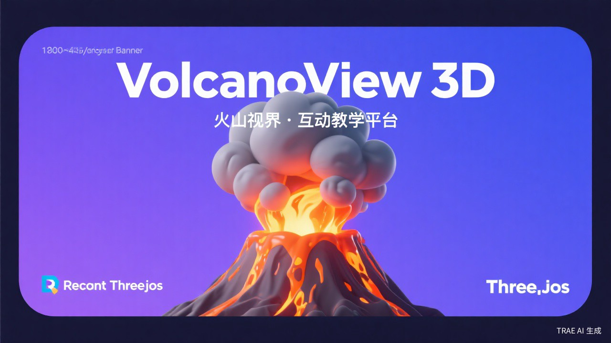
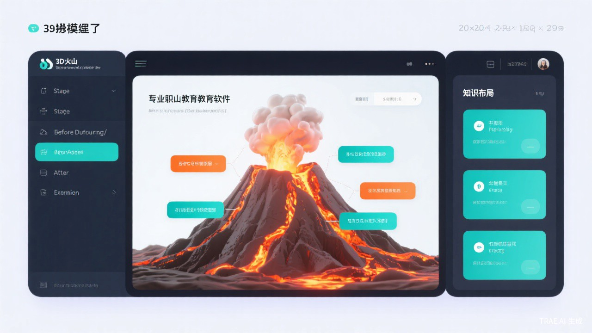

# 🌋 VolcanoView 3D | 火山视界

<p align="center">
  
</p>

<p align="center">
  <a href="https://react.dev/"></a>
  <a href="https://threejs.org/"></a>
  <a href="LICENSE"></a>
  <a href="#"></a>
</p>

<p align="center">
  <b>一款面向7-12岁中小学生的 AI 驱动 3D 火山互动科学教育应用</b>
</p>

<p align="center">
  <a href="#-快速开始">快速开始</a> •
  <a href="#-核心特性">核心特性</a> •
  <a href="#-技术栈">技术栈</a> •
  <a href="#-项目结构">项目结构</a> •
  <a href="#-自定义内容">自定义</a> •
  <a href="#-贡献指南">贡献</a>
</p>

---

## 🎬 预览

<p align="center">
  
</p>

## ✨ 核心特性

### 🌋 四阶段学习路径
- **喷发前** - 了解地下岩浆如何积聚、压力如何上升
- **喷发中** - 观察壮观的喷发过程，认识火山灰、熔岩流
- **喷发后** - 探索冷却后的地貌变化和土壤肥沃化
- **扩展知识** - 了解火山的危险与益处、科学家如何监测

### 🎮 沉浸式 3D 体验
- **360° 自由观察** - 支持旋转、缩放，全方位探索火山
- **剖面视图模式** - 一键切换，查看火山内部结构（岩浆库、岩浆通道）
- **粒子特效** - 逼真的喷发粒子效果，增强视觉冲击力

### 📍 互动热点标注
- 点击火山口、岩浆库、熔岩流等部位
- 获取详细的知识说明 + 儿童友好解释
- 图文并茂，加深理解

### 🧩 趣味问答系统
- **6 道精心设计的测验题**
- 每题 4 个选项，涵盖四阶段核心知识点
- 即时反馈 + 详细解析，巩固学习成果

### 🎬 自动演示模式
- 10 秒自动切换，完整展示火山生命周期
- 适合课堂展示或自主学习

### 👶 儿童友好设计
- 专业术语 + 童趣比喻，双重呈现
- 例如："岩浆像很热很热的石头糖浆"

## 🚀 快速开始

### 环境要求
- Node.js 18+
- npm 或 yarn

### 安装步骤

```bash
# 克隆项目
git clone https://github.com/may-ai-007/volcanoview-3d.git
cd volcanoview-3d

# 安装依赖
npm install

# 启动开发服务器
npm run dev

# 打开浏览器访问 http://localhost:5173
```

### 生产构建

```bash
npm run build
```

构建后的文件位于 `dist/` 目录，可直接部署到任何静态托管服务。

## 🏗️ 技术栈

| 技术 | 用途 |
|------|------|
| **React 18** | 前端框架 |
| **Vite** | 构建工具 |
| **Three.js + React Three Fiber** | 3D 渲染 |
| **@react-three/drei** | Three.js 辅助组件 |
| **Framer Motion** | 动画效果 |
| **Lucide React** | 图标库 |

## 📁 项目结构

```
volcano-3d/
├── 📁 public/
│   ├── 📁 models/              # GLB 3D 模型文件
│   │   ├── volcano-calm.glb
│   │   ├── volcano-erupting.glb
│   │   ├── volcano-after.glb
│   │   └── volcano-cross-section.glb
│   └── 📁 assets/              # 图片资源
│       ├── volcano-calm.jpg
│       ├── volcano-erupting.jpg
│       └── ...
├── 📁 src/
│   ├── 📁 components/          # React 组件
│   │   ├── VolcanoScene.jsx   # 3D 场景主组件
│   │   ├── StageNav.jsx       # 阶段导航
│   │   ├── KnowledgePanel.jsx # 知识面板
│   │   ├── ControlBar.jsx     # 底部控制栏
│   │   └── QuizModal.jsx      # 问答弹窗
│   ├── 📁 data/               # 数据文件
│   │   └── volcanoData.js     # 知识内容、测验题
│   ├── 📁 styles/             # 样式文件
│   │   └── App.css
│   ├── App.jsx                # 主应用组件
│   └── main.jsx               # 入口文件
├── 📄 index.html
├── 📄 package.json
├── 📄 vite.config.js
└── 📄 README.md
```

## 🎨 自定义内容

### 修改知识内容

编辑 `src/data/volcanoData.js`：

```javascript
// 修改阶段内容
export const STAGE_CONTENT = {
  before: {
    title: '喷发前',
    mainText: '你的自定义内容...',
    funFact: '你的趣味知识...',
    // ...
  }
}

// 修改测验题目
export const QUIZ_QUESTIONS = [
  {
    question: '你的问题？',
    options: [
      { id: 'A', text: '选项A', correct: true },
      // ...
    ],
    explanation: '解析说明'
  }
]
```

### 替换 3D 模型

将新的 GLB 文件放入 `public/models/`，然后在 `VolcanoScene.jsx` 中更新路径：

```javascript
const GLB_MODELS = {
  before: '/models/your-model.glb',
  // ...
}
```

### 自定义样式

修改 `src/App.css` 中的 CSS 变量：

```css
:root {
  --accent-teal: #0d9488;      /* 主色调 */
  --accent-orange: #f97316;    /* 强调色 */
  --accent-red: #ef4444;       /* 危险/喷发 */
  /* ... */
}
```

## 🌟 教育价值

### 符合课程标准
- **科学（地球与宇宙科学）** - 了解地球内部结构和地质活动
- **地理** - 认识地貌形成和板块运动
- **安全教育** - 了解自然灾害和避险知识

### 培养核心素养
- **科学探究** - 观察、提问、验证的学习过程
- **空间思维** - 3D 模型培养立体空间认知
- **信息技术** - 接触现代数字学习工具

## 🤝 贡献指南

欢迎提交 Issue 和 Pull Request！

### 贡献方式
1. 🐛 提交 Bug 报告
2. 💡 提出新功能建议
3. 🌍 添加多语言支持
4. 📚 补充更多地质知识内容
5. 🎨 优化 UI/UX 设计

### 开发流程

```bash
# Fork 项目后克隆
git clone https://github.com/may-ai-007/volcanoview-3d.git

# 创建功能分支
git checkout -b feature/your-feature

# 提交更改
git commit -m "Add: 你的功能描述"

# 推送到远程
git push origin feature/your-feature

# 创建 Pull Request
```

## 📜 许可证

本项目采用 [MIT License](LICENSE) 开源许可证。

你可以自由使用、修改、分发，用于教育或非商业目的。

## 🙏 致谢

- 3D 模型由 [Tripo 3D](https://www.tripo3d.ai/) AI 生成
- 项目灵感来源于中小学科学课程标准
- 感谢 React Three Fiber 社区提供的优秀文档

## 📮 联系我们

如有问题或建议，欢迎通过以下方式联系：

- 📧 Email: your.email@example.com
- 💬 GitHub Issues: [提交问题](https://github.com/may-ai-007/volcanoview-3d/issues)

---

<p align="center">
  Made with ❤️ for young explorers
</p>

<p align="center">
  <sub>火山视界 VolcanoView 3D - 让科学触手可及</sub>
</p>